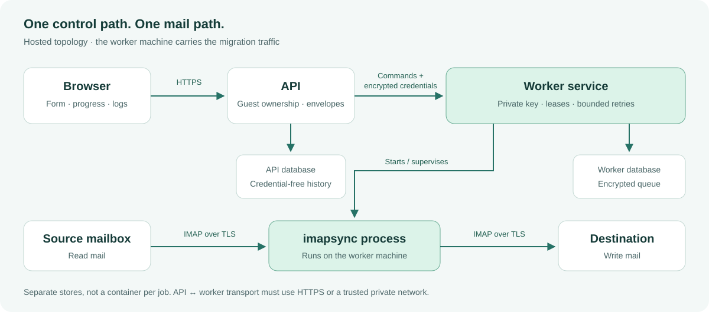

# MoveMailbox

**Ваша почта. Новый сервер. Понятный перенос.**

[Сайт](https://movemailbox.com) · [Скачать preview](https://github.com/Anton-Babaskin/MoveMailbox/releases/tag/v0.4.0-preview) · [Документация](README.md) · [English](../README.md)

MoveMailbox — интерфейс и система управления переносами на базе **imapsync**.
Вводите имя сервера или IP, логин и пароль, проверяете подключения и запускаете
копирование. Во время работы видны прогресс, журнал и состояние задания.

> [!IMPORTANT]
> Это **техническая preview-версия**, а не готовый публичный облачный сервис.
> Локальные переносы и закрытые self-hosted тесты работают. Отдельный API/worker
> реализован; перед публичным запуском нужны VPS-проверки HTTPS, сетевых ограничений,
> мониторинга и резервных копий. Макет сайта не является рабочим сервисом.

## Что умеет

| Простой старт | Контроль переноса | Проверяемый результат |
| --- | --- | --- |
| Сервер или IP, автоматические TLS-порты | Выбор папок и подпапка назначения | Прогресс и журнал событий |
| Проверка двух подключений | Пробный запуск и режимы без копирования | История заданий |
| Работа через браузер | Остановка и подтверждаемое строгое зеркало | Тесты восстановления и целостности |

Настольный запуск использует ваш компьютер и не ограничен облачным лимитом
MoveMailbox. У провайдера остаются собственные квоты. Бесплатная hosted-модель
предусматривает **целый исходный ящик до 5 ГБ**, а не первые 5 ГБ большого ящика.
[Подробности квоты](MAILBOX-QUOTA.md).

## Скачать и попробовать

- **Windows amd64:** распакуйте ZIP из [релиза](https://github.com/Anton-Babaskin/MoveMailbox/releases/tag/v0.4.0-preview), запустите `START-DEMO.cmd`.
- **Linux / macOS, amd64 или arm64:** распакуйте подходящий архив и выполните `./movemailbox --demo --open=true`.
- **Docker:** из клонированного репозитория выполните `docker compose up --build`.

Демо не подключается к почтовым серверам. Для настоящего переноса в нативной
версии нужен отдельно установленный imapsync; Dockerfile включает его runtime.
Preview-бинарники не подписаны. Сверяйте архив с `SHA256SUMS.txt` и проверяйте
`BUILD-INFO.txt`. Интерфейс по умолчанию доступен только на `127.0.0.1:8080`.

[Подробный запуск](GETTING-STARTED.md) · [Настройки](CONFIGURATION.md)

## Где проходят письма

Письма проходят через компьютер или сервер, на котором запущен движок.
Это не прямая команда пересылки между двумя почтовыми серверами.
При локальном запуске наша инфраструктура не участвует.

В hosted-режиме API получает введённые данные и шифрует их для worker.
Worker хранит зашифрованную очередь и использует свой закрытый ключ.
Шифрование не защищает от администратора, получившего полный доступ к работающему
серверу; удаление записей не гарантирует стирания остатков в WAL и бэкапах.
[Модель безопасности](../SECURITY.md).

> [!CAUTION]
> **Строгое зеркало удаляет лишние письма в назначении.**
> Нужны резервная копия, пробный запуск и явное подтверждение.
> Автоматического повтора разрушительного задания после сбоя нет.
> После обычного переноса также проверяйте результат: универсальная гарантия
> отсутствия дублей для любого IMAP-провайдера не даётся.

## Надёжность и дальнейшие этапы

Проверены сценарии обрыва APPEND, потери подтверждения записи, рестарта worker,
нехватки диска, роста ящика после оценки, ротации ключей и повреждения резервной
копии. Это отдельные испытания, а не сертификат безопасности или гарантия uptime.
[Результаты и ограничения](PILOT.md).

Далее: закрытый VPS-пилот и реальный off-site restore, затем коммерческий слой.
OAuth, платёжные права и бизнес-функции не выдаём за уже доступные возможности.
[Roadmap](ROADMAP.md).

## Помощь, участие и права

[Сообщить о проблеме](../SUPPORT.md) · [Участие](../CONTRIBUTING.md) · [Изменения](../CHANGELOG.md)

Уязвимости отправляйте [приватно](https://github.com/Anton-Babaskin/MoveMailbox/security/advisories/new).
Не публикуйте пароли, токены, cookies, письма и неочищенные журналы.

Лицензия собственного кода пока не выбрана владельцем. Публичность GitHub сама
по себе не делает проект open source. [Статус лицензии](LICENSING.md).
imapsync — отдельный проект Gilles Lamiral со своей лицензией.
[Сторонние компоненты](../THIRD_PARTY_NOTICES.md).

Создатель и сопровождающий — [Антон Бабаскин](https://github.com/Anton-Babaskin).
